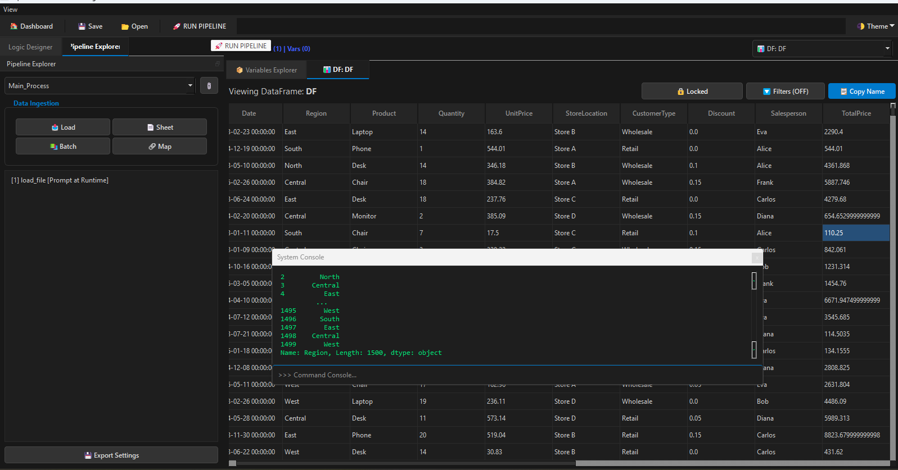

# AutomateFlow IDE: Advanced Automation Workflow Studio


<p align="center">
  
</p>

AutomateFlow IDE is a professional, high-performance "No-Code/Low-Code" studio designed for building and executing complex data automation workflows. This system transforms raw data into refined outputs using a hybrid engine that combines the speed of **Pandas** with the precision of native **Excel Formula Evaluation**.

---

## 🚀 Key Features

### 1. Extreme Performance ("VICE-VERSA" Engine)
*   **Multi-Threaded Pipelines:** Independent data processes run **simultaneously** on separate CPU threads.
*   **Parallel Ingestion:** Batch loads all sheets from workbooks concurrently, resulting in a **3x to 5x speedup** for large datasets.
*   **Lazy Loading:** Utilizes `pd.ExcelFile` caching to minimize disk I/O during multi-step transformations.

### 2. Advanced Data Ingestion
*   **Batch Load Sheets:** Load entire Excel workbooks (dozens of tabs) into memory with a single click.
*   **Smart Mapping:** A dedicated UI tool for SQL-like **Left Joins**. Match columns across different datasets and selectively copy data.
*   **Path Resilience:** Automatically detects broken file paths and triggers a fallback prompt at runtime to prevent execution crashes.

### 3. Professional Automation IDE (UI/UX)
*   **Excel-Style Interaction:** Native filtering and sorting on every data tab with a high-contrast visual indicator system.
*   **Interactive Terminal:** A built-in Python REPL for real-time data manipulation and debugging during workflow execution.
*   **Detachable Panels:** Fully flexible layout with detachable, floatable, and stackable docks (Explorer, Logic Designer, Console).
*   **World-Class Themes:** High-density **Matte Dark Mode** and **Paper Light Mode** optimized for long-duration workflow engineering.

---

## 🏗 System Architecture

The system follows an **In-Memory State Model** controlled by three core layers:

### A. The Engine (`dynamic_engine.py`)
*   **OmniEvaluator:** A sandboxed execution environment that allows running arbitrary Python/Pandas logic on live DataFrames.
*   **ExcelFormulaEngine:** Bridges to `xlwings` to evaluate 100% of native Excel formulas in a background instance—perfect for logic that requires Excel's native calculation engine.

### B. The UI (`workflow_ide.py`)
*   A comprehensive **PyQt5** application serving as the command center.
*   Handles configuration management, pipeline visualization, and provides "Floating Tooltips" for instant data feedback.

### C. The Schema (`Config/*.json`)
*   JSON-based pipeline definitions that map raw files to memory aliases and define the sequence of execution steps.

---

## 🛠 Installation

### Prerequisites
*   Python 3.10 or higher
*   Microsoft Excel (required only if using the Excel Formula Engine)

### Setup
1. Clone the repository:
   ```bash
   git clone https://github.com/Asadullah404/Automate_Data_engineering_IDE.git
   cd Automate_Data_engineering_IDE
   ```

2. Install dependencies:
   ```bash
   pip install -r requirements.txt
   ```

---

## 📖 Usage

### Running the App
```bash
python workflow_ide.py
```

### Creating an Automation Workflow
1.  **Dashboard:** Create a new pipeline or select an existing JSON config.
2.  **Explorer:** Use "Load Source Data" or "Batch Load Sheets" to bring data into memory.
3.  **Logic Designer:**
    *   **Execute Python:** Write Pandas code like `df['Total'] = df['Price'] * 1.2`.
    *   **Excel Formula:** Enter formulas like `=SUM(Sheet1!A:A)` to run them through Excel.
    *   **Mapping:** Click "🔗 Map" to merge two tables based on a key column.
4.  **Run:** Click "🚀 RUN PIPELINE" to execute all threads in parallel.

---

## 📦 Packaging (Standalone .exe)

To create a portable version of the IDE:

1.  Run the build script:
    ```powershell
    python build_simple.py
    ```
2.  The standalone file will be generated at: `dist/AutomateFlow_PRO.exe`.

*Note: Ensure the `Config` and `Custom_Scripts` folders are kept in the same directory as the .exe.*

---

## 🛡 License
Distributed under the MIT License. See `LICENSE` for more information.

## 👥 Authors
*   **Implementation & Architecture:** [Your Name]
